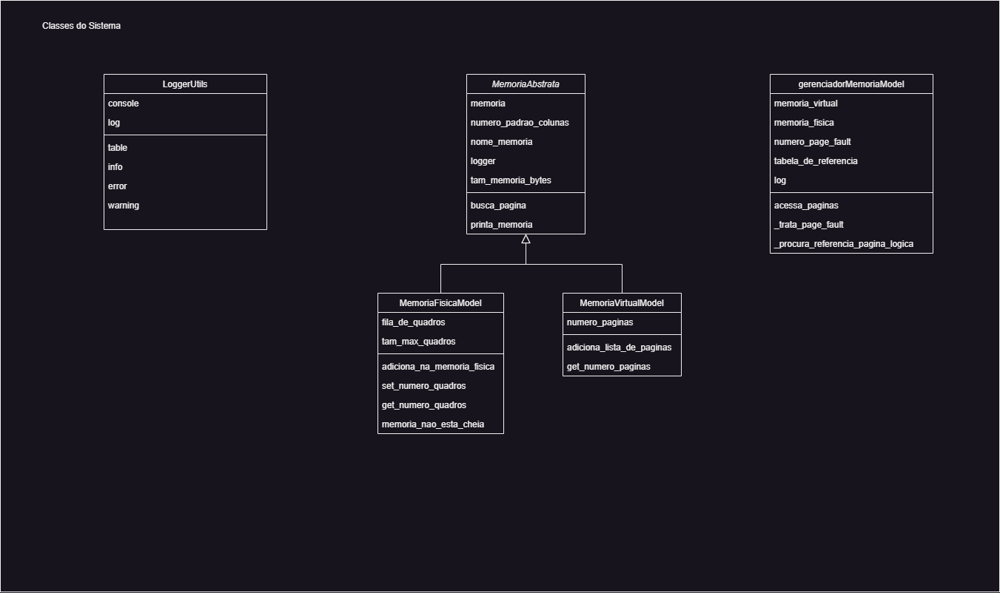
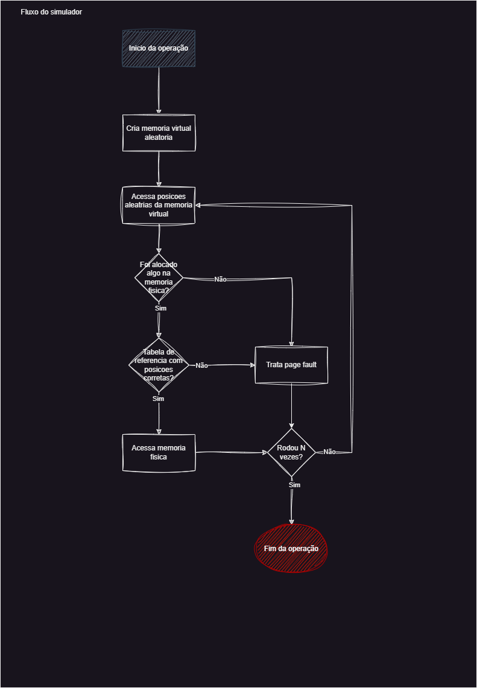

# Simulador-Gerenciador-de-Memoria


## Arquitetura e instalação
### Diagrama de classe


### Fluxo do sistema
 

### Instruçoes e requisitos de instalação
Sistema é denvolvido na linguagem __python__, que pode ser feito o download [teste](https://www.python.org/downloads/)

Esse sistema depende da dependencia Rich, então é obrigatorio o pacote estar instalado:
```Bash
pip install -r ./requirements.txt
```