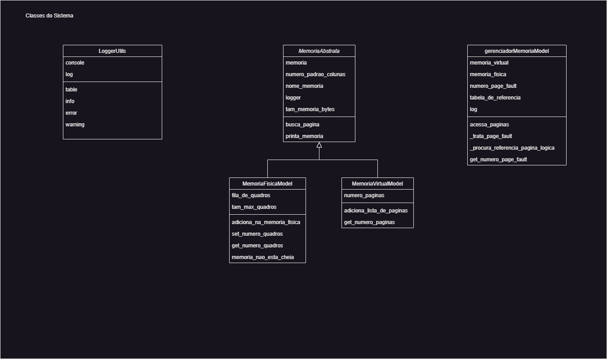

# Sobre

O **Simulador-Gerenciador-de-Memoria** é um simulador de gerenciamento de memória com paginação de um sistema operacional. O gerenciamento de memória é o processo pelo qual o sistema operacional controla e organiza o uso da memória de um computador, assegurando que os programas em execução tenham acesso eficiente aos recursos de memória.

Existem dois tipos de abstração de memória no contexto do gerenciamento de memória em um sistema operaiconal:

- **Memória Física**: A memória física refere-se ao hardware real usado para armazenar os dados dos programas em um computador, ou seja é a própria memória RAM em si.

- **Memória Virtual**: A memória virtual é uma abstração para todo o espaço de endereçamento de um programa.

Dividindo-se a memória física e virtual em paginas/molduras e utilizando as técnicas de gerenciamento é possível executar programas que tenham espaço necessário maiores que memória física.

# Pré-requisitos

Sistema é denvolvido na linguagem __python__, que pode ser feito o download [teste](https://www.python.org/downloads/)

Esse sistema depende da dependencia Rich, então é obrigatorio o pacote estar instalado:
```Bash
pip install -r ./requirements.txt
```

# Funcionamento do Simulador

A cada passo na simulação o programa realiza as seguintes operações:

+ Gera um endereço lógico (endereço que vem do processador)
+ Calcula a página e o deslocamento de acordo com os bits do endereço
+ Exibe o endereço gerado, o número da página, do deslocamento e do total de page faults
+ Tenta acessar o endereço gerado na memória física
+ Imprime o conteúdo das memórias virtual e física

No inicio do programa deve-se especificar o tamanho da memória física e virtual em número de páginas.

# Arquitetura do Sistema

A arquitetura do simulador é composta pelos seguintes componentes: Memória Virtual, Memória Física, Gerenciador de Memória, ...

Cada página/moldura tem tamanho de 4 bytes

# Memória Virtual

# Memória Física

# Gerenciador de Memória


### Diagrama de classe


### Fluxo do sistema
 
